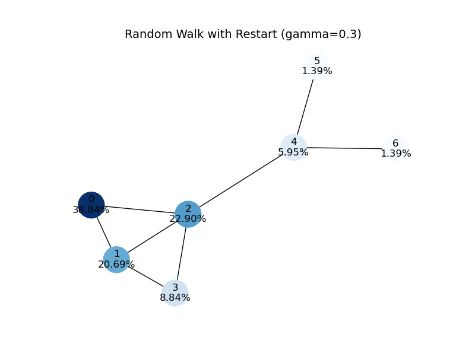
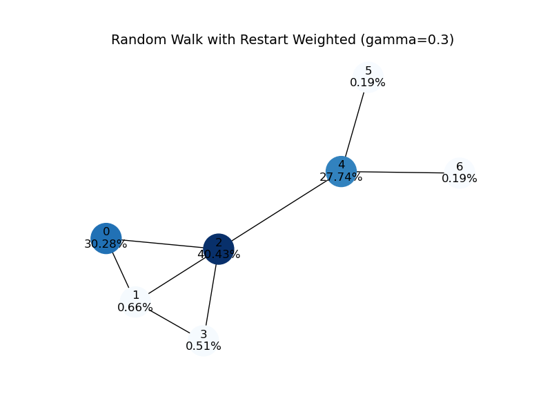
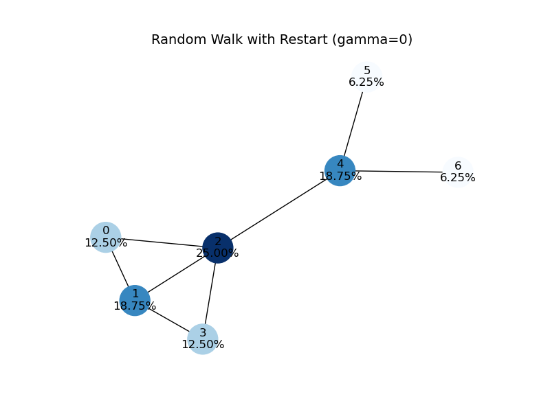
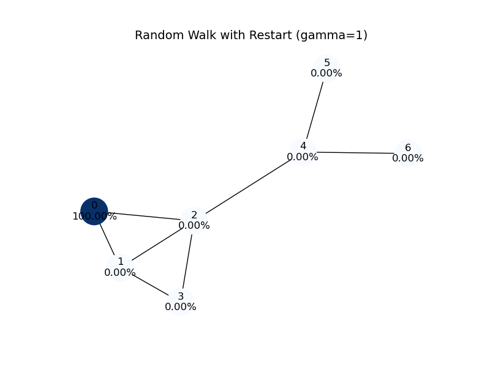
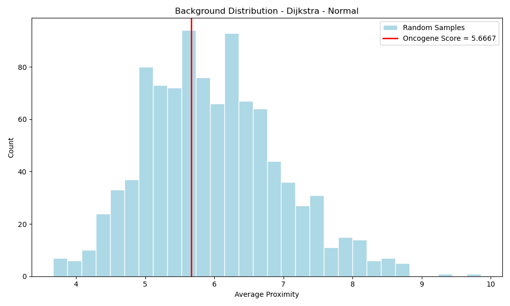
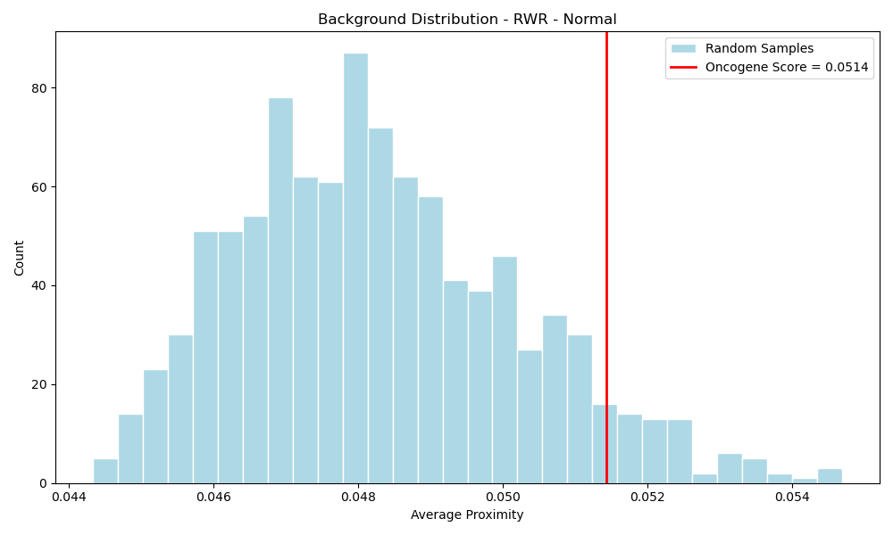

# Network Proximity of Oncogenic Proteins

Analysis of cancer driver gene proximity in the human Protein-Protein Interaction (PPI) network using Shortest Path (Dijkstra) and Random Walk with Restarts (RWR).

## Overview

Proteins that share a biological function tend to interact with many of the same partners, placing them close to one another in the Protein-Protein Interaction (PPI) network. Cancer driver genes, which cooperate to dysregulate cell growth, division, and survival, are expected to follow this same pattern: they should be significantly more proximal to each other in the network than a randomly chosen set of proteins of the same size.

This project tests that hypothesis using two complementary network proximity metrics applied to a set of seven known oncogenes from The Cancer Genome Atlas (TCGA) kidney cancer study. Statistical significance is evaluated against 1,000 background trials of randomly sampled non-oncogenic proteins. The analysis is run on both the original PPI network and a degree-preserving randomized version to confirm that any observed proximity is a product of true biological wiring rather than an artifact of the degree distribution.

Using the stationary distribution from RWR seeded on the known oncogenes, we rank all remaining proteins in the network and report the top 30 as predicted novel cancer driver candidates.


## RWR Intuition

Standard graph distance measures like Dijkstra capture only the single shortest path between two nodes, ignoring the broader connectivity structure of the network. Random Walk with Restarts addresses this by simulating a walker that explores the full topology.

At each step the walker faces two mutually exclusive choices: with probability gamma it teleports back to the seed nodes (the known oncogenes), and with probability (1 - gamma) it moves to a randomly chosen neighbor. This restart mechanism keeps the walk anchored to the seed while still allowing it to explore the surrounding network. Over many iterations the walk converges to a stationary probability distribution where each node's value reflects how reachable it is from the seed, factoring in every path through the network simultaneously rather than just the shortest one.

The gamma parameter controls the trade-off between exploration and seed fidelity. At gamma = 0 the walk is purely exploratory and the stationary distribution mirrors node degree almost perfectly (Spearman r = 0.99). At gamma = 1 the walk never leaves the seed and all probability mass stays at the starting nodes. At gamma = 0.3, used throughout this analysis, the walk is anchored to the seed while still meaningfully exploring the surrounding topology.

Edge weights act as pipe widths: a high-weight edge draws more probability flow toward that neighbor, allowing the walk to be steered by interaction strength rather than treating all edges as equal.

The proximity score for a set of proteins is the average stationary probability assigned to those nodes at convergence. A higher score means the proteins collectively occupy a well-connected, mutually reachable region of the network relative to a random set.

**RWR Simulation (gamma = 0.3)**



**RWR Weighted Simulation**



**RWR Simulation (gamma = 0)**



**RWR Simulation (gamma = 1)**




## Methods

**Dijkstra Shortest Path**  
Computes the average minimum edge distance across all pairs of seed oncogenes. A lower average indicates tighter clustering. Significance is assessed against a background distribution of 1,000 randomly sampled non-oncogenic protein sets of equal size.

**Random Walk with Restarts (RWR)**  
Simulates a walker that at each step either teleports back to the seed nodes with probability gamma, or moves to a random neighbor with probability (1 - gamma). The proximity score is the average stationary probability assigned to the seed oncogenes at convergence. Unlike Dijkstra, RWR captures the full network topology rather than a single shortest route.

**Graph Randomization**  
To confirm that proximity reflects true biological wiring rather than the degree distribution, the graph is randomized via degree-preserving edge swapping (20|E| swaps). Both metrics are re-evaluated on the randomized graph.


## Results

| Metric   | Randomized | p-value | Significant (α = 0.10) |
|----------|------------|---------|------------------------|
| RWR      | No         | 0.067   | Yes                    |
| RWR      | Yes        | 0.682   | No                     |
| Dijkstra | No         | 0.416   | No                     |
| Dijkstra | Yes        | 0.145   | No                     |

RWR detected statistically significant oncogene clustering on the original network. After randomization, both metrics returned scores indistinguishable from random, confirming the proximity is a product of biological topology rather than degree distribution.

## Background Distributions

**Background Distribution Dijkstra**



**Background Distribution RWR**



## Predicted Novel Cancer Driver Genes

Top 30 proteins predicted by RWR (excluding seed genes), stored in `outputs/Sahand_Aslani_onco_predictions.txt`.

Seed oncogenes used: `ARID1A`, `KIF1B`, `DST`, `PKHD1`, `TP53`, `COL5A3`, `SMARCA4`


## Data

| File | Description |
|------|-------------|
| `data/interacting_proteins.txt` | Human PPI pairs from NCBI curated database |
| `data/onco_genes.txt` | Seed oncogenic genes from TCGA kidney cancer study |


## Setup

**Environment**

```bash
conda env create -f environment.yml
conda activate <env-name>
```

**Dependencies**

- Python 3.12
- numpy
- scipy
- matplotlib
- networkx


## Usage

**Main analysis** generates background distributions, significance tests, and oncogene predictions:

```bash
python main.py
```

Output files written to `./outputs/`:
- `dijkstra_background_Normal.png`
- `rwr_background_Normal.png`
- `Sahand_Aslani_onco_predictions.png`
- `Sahand_Aslani_onco_predictions.txt`

**RWR intuition** generates simulation plots illustrating algorithm behavior across gamma values and edge weights:

```bash
python rwr_intuition.py
```

Output files written to `./outputs/`:
- `rwr_simulation.png`
- `rwr_weighted_simulation.png`
- `rwr_simulation_gamma_0.png`
- `rwr_simulation_gamma_1.png`

## Hardware

Tested on Apple M4 Pro. The `rwr_intuition.py` pipeline completes in seconds. The `main.py` pipeline takes approximately 30 minutes.

## Reference

Sahand Aslani *Network Proximity of Oncogenic Proteins*.  
Data provided by Dr. Borislav Hristov, CalPoly San Luis Obispo.  
PPI data sourced from the NCBI curated human protein interaction database.  
Seed oncogenes sourced from The Cancer Genome Atlas (TCGA) kidney cancer study.
